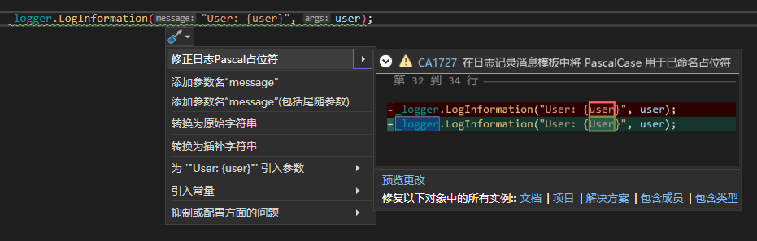
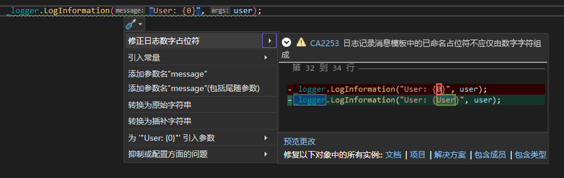
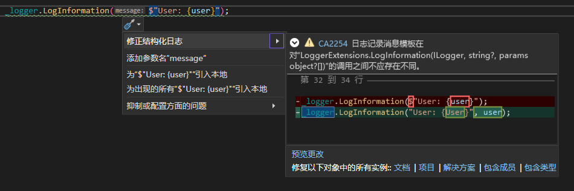

# Cuture.CodeAnalysis.LoggingCodeFixes

Code fix provider for `C#` code logging diagnosis `CA1727`, `CA2253`, `CA2254`

针对 `C#` 代码日志诊断 `CA1727`, `CA2253`, `CA2254` 的代码修复提供程序

## 如何使用

- 引用 `Cuture.CodeAnalysis.LoggingCodeFixes` 包
```xml
<ItemGroup>
  <PackageReference Include="Cuture.CodeAnalysis.LoggingCodeFixes" Version="1.0.0" PrivateAssets="All" />
</ItemGroup>
```

## 示例




